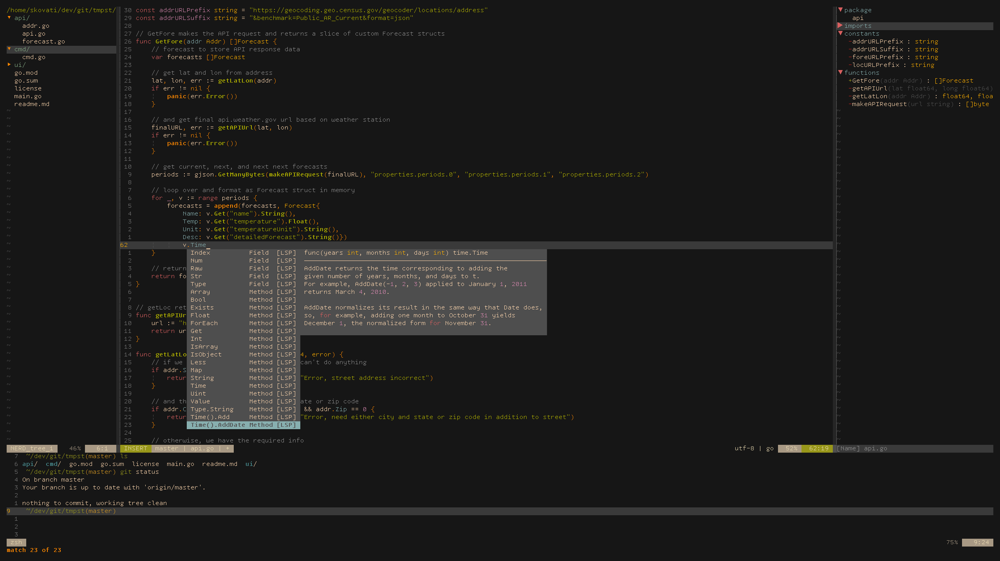

# dotfiles

### personal dotfiles for bspwm, vim, zsh, etc.

| program                               | name                                                                              |
| :---                                  | :---                                                                              |
| distro                                | [arch](https://www.archlinux.org/)                                                |
| wm                                    | [dwm](https://dwm.suckless.org/)                                                  |    
| bar                                   | [dbar](https://github.com/skovati/dotfiles/tree/master/bin/.local/bin/dbar)                   |
| launcher                              | [dmenu](https://tools.suckless.org/dmenu/)                                        |
| pape                                  | [feh](https://github.com/derf/feh)                                                |
| browser                               | [firefox](https://www.mozilla.org/en-US/firefox)                                  |
| editor                                | [neovim](https://neovim.io/)                                                      |
| font                                  | [tamzen](https://github.com/sunaku/tamzen-font)                                   |
| shell                                 | [zsh](https://www.zsh.org/)                                                       |
| term                                  | [alacritty](https://github.com/alacritty/alacritty)                               |
| doc viewer                            | [zathura](https://pwmt.org/projects/zathura/)                                     |
| file manager                          | [lf](https://github.com/gokcehan/lf)                                              |
| colorscheme                           | [gruvbox](https://github.com/morhetz/gruvbox)          |

### installation

```
install arch linux
git clone https://github.com/skovati/dotfiles
cd dotfiles
stow */
```
#### screenshot

#### Vim IDE-like programming setup

